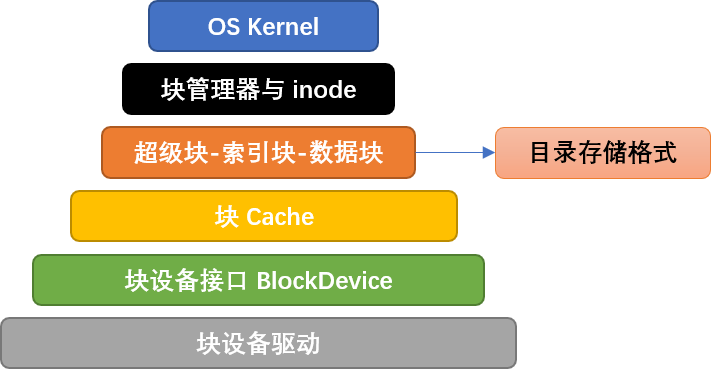

# rCore 2025S 过程记录

本实验根据 [rCore-2025S 指导书](https://learningos.cn/rCore-Tutorial-Guide-2025S/) 以及[提供的初始实验仓库](https://github.com/LearningOS/rCore-Tutorial-Code-2025S)完成。

## 目录

- [环境配置](#环境配置)
- [运行](#运行)
- [完成过程](#完成过程)
    - [ch3：多道程序与分时多任务](#ch3)
    - [ch4：地址空间](#ch4)
    - [ch5：进程及进程管理](#ch5)
    - [ch6：文件系统与I/O重定向](#ch6)
    - [ch8：并发](#ch8)


## 环境配置

不要使用 rCore-Tutorial-Book-v3 里面的实验仓库！尽量用最新的实验指导书和仓库！

- 之前基于 [rCore-Tutorial-Book-v3](https://rcore-os.cn/rCore-Tutorial-Book-v3/index.html) 写 rCore，使用链接中提供的[配置好的虚拟机](https://pan.baidu.com/share/init?surl=yQHtQIXQUbHCbyqSPtuqqQ&pwd=pcxf)运行，发现在环境配置方面存在诸多问题
    - 使用 VirtualBox NAT 模式，如需使用代理，需要在 host 机上设置 Allow LAN
    - 在虚拟机可以访问Google的情况下，make docker 仍然会遇到网络问题
    - 不使用 docker。在不做改动的情况下无法通过基础测例，提示 rustup nightly 版本问题
- 于是更换到最新的实验参考书 [rCore 2025S](https://learningos.cn/rCore-Tutorial-Guide-2025S/0setup-devel-env.html)
    - 使用本地 WSL2
    - make docker 仍然会出现问题，提示 pull 被拒绝。于是手动配置环境
    - 解压步骤中（qemu-7.0.0.tar.xz）会产生符号链接，像 NTFS 之类的文件系统支持符号链接，而如 exFAT 之类的无法支持，解压时会出现问题
    - 环境问题已经解决（将项目迁移到 NTFS 上），可以跑通 ch1~ch8 的基础测例
- [仓库链接](https://github.com/hy-huang20/rCore-2025S)

## 运行

实验指导书[第三章](https://learningos.cn/rCore-Tutorial-Guide-2025S/chapter3/5exercise.html#id5)给出了说明：

>默认情况下，makefile 仅编译基础测例 (BASE=1)，即无需修改框架即可正常运行的测例。 你需要在编译时指定 BASE=0 控制框架仅编译实验测例（在 os 目录执行 make run BASE=0）， 或指定 BASE=2 控制框架同时编译基础测例和实验测例。

如果使用 VS Code 开发，下载一个 rust-analyzer 插件会方便很多。如果在 wsl 上配置好 rust 环境并运行项目，而编程是在 windows 上完成，则为了 rust-analyzer 插件能够在编程时正常工作，需要在 windows 上也配置好 rust 环境。

## 完成过程

主要需要完成 5 个分支的编程实验：

- ch3：多道程序与分时多任务
- ch4：地址空间
- ch5：进程及进程管理
- ch6：文件系统与I/O重定向
- ch8：并发

个人向难度评级为 ch8 > ch6 > ch4 > ch5 > ch3，其中第 4，6，8 都有一定难度。文档很详细，个人觉得难度主要是需要理解什么文件中的代码做什么事，我要实现/增加某个功能的话需要修改哪个文件中哪里的代码。

### 时间

|rCore-2025S|完成时间|任务数（旧+新）|
|---|---|---|
|ch3|20250503|1|
|ch4|20250511|2+2|
|ch5|20250512|3+2|
|ch6|20250519|5+3|
|ch8|20250603|1+1|


### ch3

#### 编程实验

最简单的一章

只需要实现一个 ``sys_trace`` 系统调用

首先是熟悉一下如何利用 rust 实现从指定地址读/向指定地址写单字节数据：

```rust
// os/src/syscall/process.rs

use core::ptr;

unsafe { ptr::read(addr) }; // 读
unsafe { ptr::write(addr, data) }; // 写
```

读写每次均只涉及一个字节，因此如果遇到写的情形需要首先将形参中的 _data 转为 u8 以获取低位单字节。

``sys_trace`` 还有一个功能就是获取当前 task 调用任意编号系统调用的次数，因此需要在每次 syscall 的时候记录在某个地方。我的做法是为每个 tcb 增加一个 usize **定长数组**属性用来记录。定长数组的大小我设置为 500，即 syscall id 的一个上界。

### ch4

#### 编程实验

难度有些大

##### 概述

```rust
// os/src/task/task.rs

pub struct TaskControlBlock {
    // ...
    /// Application address space
    pub memory_set: MemorySet,
    // ...
}
```

```rust
// os/src/mm/memory_set.rs

pub struct MemorySet {
    page_table: PageTable,
    areas: Vec<MapArea>,
}

pub struct MapArea {
    vpn_range: VPNRange,
    data_frames: BTreeMap<VirtPageNum, FrameTracker>,
    map_type: MapType,
    map_perm: MapPermission,
}
```

```rust
// os/src/mm/page_table.rs

/// page table structure
pub struct PageTable {
    root_ppn: PhysPageNum,
    frames: Vec<FrameTracker>,
}
```

简而言之就是每个 task 对应一个 tcb，每个 tcb 中有个 memory_set 属性表示地址空间，每个 memory_set 中有当前 task 的页表和一些 MapArea，每个 MapArea 是一段虚存映射。PageTable 里面的 frames 存储了页表所有节点对应的物理帧，这些帧用来存 pte；而 MapArea 里面的 data_frames 存储了页表三级节点中的最后一级（叶节点）指向的物理帧，这些帧用来存数据。

##### 读写用户态数据

其实最需要注意的地方就是所有 syscall 函数形参中的地址都变成虚拟地址了，而且在这之后的每一章实验中都需要记住这一点。

由于此时用户态 task 的地址全是虚拟地址，所以不能直接用上一章的方法读写用户态数据了。由于上一章的一些 syscall 接口涉及到从内核对用户态 task 数据的访问，因此**需要重新实现**。

具体是需要将用户态 task 的虚拟地址，利用该 task 的页表转换为物理地址。如果要实现从 os 访问修改用户态的数据，需要用好 ``translated_byte_buffer`` 函数。比如下面就是为了方便内核向用户态 task 拷贝数据而实现的函数：

```rust
// os/src/syscall/process.rs

/// 为了方便内核向用户态进程拷贝数据而实现的函数
pub fn os_data_copy_to_user(os_ptr: *const u8, user_ptr: *const u8, data_len: usize) {
    let token = current_user_token();
    let user_buffers = translated_byte_buffer(token, user_ptr, data_len);
    let os_data_byte_arr: &[u8] = unsafe { 
        core::slice::from_raw_parts(os_ptr, data_len) 
    };
    let mut byte_idx: usize = 0;
    for buffer in user_buffers {
        buffer.copy_from_slice(&os_data_byte_arr[byte_idx..byte_idx+buffer.len()]);
        byte_idx += buffer.len();
    }
}
```

``translated_byte_buffer`` 已经由实验框架提供：

```rust
// os/src/mm/page_table.rs

/// Translate&Copy a ptr[u8] array with LENGTH len to a mutable u8 Vec through page table
pub fn translated_byte_buffer(token: usize, ptr: *const u8, len: usize) -> Vec<&'static mut [u8]> {
    let page_table = PageTable::from_token(token);
    let mut start = ptr as usize;
    let end = start + len;
    let mut v = Vec::new();
    while start < end {
        let start_va = VirtAddr::from(start);
        let mut vpn = start_va.floor();
        let ppn = page_table.translate(vpn).unwrap().ppn();
        vpn.step();
        let mut end_va: VirtAddr = vpn.into();
        end_va = end_va.min(VirtAddr::from(end));
        if end_va.page_offset() == 0 {
            v.push(&mut ppn.get_bytes_array()[start_va.page_offset()..]);
        } else {
            v.push(&mut ppn.get_bytes_array()[start_va.page_offset()..end_va.page_offset()]);
        }
        start = end_va.into();
    }
    v
}
```

``translated_byte_buffer`` 会以向量的形式返回一组可以在内核空间中直接访问的字节数组切片。为什么以向量形式呢，因为访问可能会跨多个页，而向量中的每个元素（每个 slice）会包含至多一个页的数据，这是因为对数据的访问并不一定能够按页对齐。由于返回的是 slice 的可变引用，因此可以直接读写，十分方便。

##### 虚存映射的建立与取消

```rust
// os/src/task/mod.rs

pub fn map_for_current_task(start_vpn: VirtPageNum, num_pages: usize, map_perm: MapPermission) -> isize {
    let task_id = get_current_task_id();
    let memory_set = &mut TASK_MANAGER.inner.exclusive_access().tasks[task_id].memory_set;
    let mut end_vpn = start_vpn;
    for _ in 0..num_pages {
        if let Some(pte) = memory_set.translate(end_vpn) {
            if pte.is_valid() { // vpn 已经被映射到了已经存在的物理页
                return -1;
            }
        }
        end_vpn.step();
    }
    let start_va = VirtAddr::from(start_vpn);
    let end_va = VirtAddr::from(end_vpn);
    // 一块新的 MapArea，会自动 map PageTable
    memory_set.insert_framed_area(start_va, end_va, map_perm);
    return 0;
}

pub fn unmap_for_current_task(start_vpn: VirtPageNum, num_pages: usize) -> isize {
    let task_id = get_current_task_id();
    let memory_set = &mut TASK_MANAGER.inner.exclusive_access().tasks[task_id].memory_set;
    let mut end_vpn = start_vpn;
    for _ in 0..num_pages {
        if let Some(pte) = memory_set.translate(end_vpn) {
            if !pte.is_valid() { // 不能解除不存在的映射
                return -1;
            }
            memory_set.unmap_from_page_table(end_vpn);
            end_vpn.step();
        } else { // 不能解除不存在的映射
            return -1;
        }
    }
    return 0;
}
```

查 task 的页表通过调用该 task 对应的 tcb 的 memory_set 属性的 translate 函数，该函数实际上会调用 memory_set.page_table 的 translate 函数，这是 PageTable 提供的不经过 MMU 而是手动查页表的方法，以方便实现。

```rust
// os/src/mm/page_table.rs

impl PageTable {
    /// Temporarily used to get arguments from user space.
    pub fn from_token(satp: usize) -> Self {
        Self {
            root_ppn: PhysPageNum::from(satp & ((1usize << 44) - 1)),
            frames: Vec::new(),
        }
    }
    fn find_pte(&self, vpn: VirtPageNum) -> Option<&PageTableEntry> {
        let idxs = vpn.indexes();
        let mut ppn = self.root_ppn;
        let mut result: Option<&PageTableEntry> = None;
        for i in 0..3 {
            let pte = &ppn.get_pte_array()[idxs[i]];
            if i == 2 {
                result = Some(pte);
                break;
            }
            if !pte.is_valid() {
                return None;
            }
            ppn = pte.ppn();
        }
        result
    }
    pub fn translate(&self, vpn: VirtPageNum) -> Option<PageTableEntry> {
        self.find_pte(vpn)
            .map(|pte| {pte.clone()})
    }
}
```

其实很多接口已经设计地很好了可以直接用了，最好在看懂的前提下合理运用。当然，直接绕过**上层接口**而调用 frame_alloc() 且自己设置 pte 的内容似乎并不影响测例的通过。但是如果直接调用 frame_alloc() 的话所分配的 frame 默认不会被记录到 MapArea 以及 PageTable 中。而将 frame 添加到 MapArea 或 PageTable 中的用意是利用 RAII 思想，将这些 frame 的生命周期绑定到逻辑段 MapArea 或页表 PageTable 下，以便逻辑段和页表被回收之后这些之前分配的物理页帧也会自动地同时被回收。

### ch5

#### 编程实验

简单

##### spawn 一个新子进程

虽然不要将 spawn 生硬实现为 fork + exec, 但实际 spawn 的代码也差不多就是照着已有的 fork, exec 代码复制粘贴拼接。

```rust
// os/src/syscall/process.rs

/// YOUR JOB: Implement spawn.
/// HINT: fork + exec =/= spawn
pub fn sys_spawn(_path: *const u8) -> isize {
    trace!("kernel:pid[{}] sys_spawn", current_task().unwrap().pid.0);
    let token = current_user_token();
    let path = translated_str(token, _path);
    if let Some(data) = get_app_data_by_name(path.as_str()) {
        let current_task = current_task().unwrap();
        let new_task = current_task.spawn(data);
        let new_pid = new_task.pid.0;
        // add new task to scheduler
        add_task(new_task);
        new_pid as isize
    } else {
        -1
    }
}
```

仍然注意 sys_spawn 形参 _path 是**虚拟地址**。其次 spawn 是从父进程创建一个子进程，并非对调用进程的覆盖，无论成功与否，父进程都会收到相应返回值。

spawn 的完整实现：

```rust
// os/src/task/task.rs

impl TaskControlBlock {
    // ...

    pub fn spawn(self: &Arc<Self>, elf_data: &[u8]) -> Arc<Self> {
        // ---- access parent PCB exclusively
        let mut parent_inner = self.inner_exclusive_access();
        // memory_set with elf program headers/trampoline/trap context/user stack
        let (memory_set, user_sp, entry_point) = MemorySet::from_elf(elf_data);
        let trap_cx_ppn = memory_set
            .translate(VirtAddr::from(TRAP_CONTEXT_BASE).into())
            .unwrap()
            .ppn();
        // alloc a pid and a kernel stack in kernel space
        let pid_handle = pid_alloc();
        let kernel_stack = kstack_alloc();
        let kernel_stack_top = kernel_stack.get_top();
        let task_control_block = Arc::new(TaskControlBlock {
            pid: pid_handle,
            kernel_stack,
            inner: unsafe {
                UPSafeCell::new(TaskControlBlockInner {
                    trap_cx_ppn,
                    base_size: user_sp,
                    task_cx: TaskContext::goto_trap_return(kernel_stack_top),
                    task_status: TaskStatus::Ready,
                    memory_set,
                    parent: Some(Arc::downgrade(self)),
                    children: Vec::new(),
                    exit_code: 0,
                    heap_bottom: parent_inner.heap_bottom,
                    program_brk: parent_inner.program_brk,
                    stride: 0,
                    priority: 16,
                })
            },
        });
        // initialize trap_cx
        let inner = task_control_block.inner_exclusive_access();
        let trap_cx = inner.get_trap_cx();
        *trap_cx = TrapContext::app_init_context(
            entry_point,
            user_sp,
            KERNEL_SPACE.exclusive_access().token(),
            kernel_stack_top,
            trap_handler as usize,
        );
        drop(inner);
        // add child
        parent_inner.children.push(task_control_block.clone());
        // return
        task_control_block
    }

    // ...
}
```

需要注意的是 spawn **不需要**像 fork 那样去复制父进程地址空间，因此 memory_set 应像 exec 中那样调用 MemorySet::from_elf 而不是像 fork 中那样调用 MemorySet::from_existed_user。

```rust
// os/src/task/task.rs

impl TaskControlBlock {
    // ...

    pub fn exec(&self, elf_data: &[u8]) {
        // ...

        // **** access current TCB exclusively
        let mut inner = self.inner_exclusive_access();
        // substitute memory_set
        inner.memory_set = memory_set;
        // update trap_cx ppn
        inner.trap_cx_ppn = trap_cx_ppn;
        // initialize base_size
        inner.base_size = user_sp;
        // initialize trap_cx
        let trap_cx = inner.get_trap_cx();
        *trap_cx = TrapContext::app_init_context(
            entry_point,
            user_sp,
            KERNEL_SPACE.exclusive_access().token(),
            self.kernel_stack.get_top(),
            trap_handler as usize,
        );
        // **** release inner automatically
    }

    // ...
}
```

以及 spawn 对新进程中 inner 相关字段的设置（包括 memory_set, trap_cx_ppn, base_size, trap_cx）要按照 exec 中的来而不是按照 fork 中的来。这几个字段的功能分别是：

- ``memory_set`` 表示应用地址空间
    - ``fork`` 应该**复制**一份父进程的地址空间过来
    - ``exec`` 根据新进程 elf 文件内容设置
    - ``spawn`` 同 ``exec``
- ``trap_cx_ppn`` 指出了应用地址空间中的 Trap 上下文被放在的物理页帧的物理页号
    - ``fork``, ``exec``, ``spawn`` 均使用 memory_set 获取虚拟地址 TRAP_CONTEXT_BASE 对应的 pte 并提取 ppn 
- ``base_size`` 含义是：应用数据仅有可能出现在应用地址空间低于 base_size 字节的区域中。借助它我们可以清楚的知道应用有多少数据驻留在内存中
    - ``fork`` 同父进程 base_size
    - ``exec`` 可以查看 os/src/mm/memory_set.rs 下的 MemorySet 中的 from_elf 理解 base_size 的含义
        - elf 文件中有多个 program header，地址自低向高，每个 program header 描述了一个段，对应一个 MapArea；这之后地址再往高有一个 guard 页隔着；再往高就是用户栈空间了，从 user_stack_bottom 开始到 user_stack_top 大小为 USER_STACK_SIZE。于是 base_size 即为这个栈的 user_stack_top，即该应用的所有数据仅有可能出现在应用地址空间低于 user_stack_top 字节的区域中。
    - ``spawn`` 同 ``exec``
- ``trap_cx`` 地址处保存任务上下文，用于任务切换。其实就是 trap_cx_ppn.get_mut()
    - ``fork`` 的 ``trap_cx`` 地址处的内容还是同父进程，内容是在复制 memory_set 时从父进程复制过来的
    - ``exec`` 的 ``trap_cx`` 处的内容应该用新应用的初始 trap_cx，即 TrapContext::app_init_context 来覆盖
    - ``spawn`` 同 ``exec``

##### 进程优先级

根据实验指导书来就可以。我的做法是：

- 在 tcb inner 里增加两个属性 

```rust
// os/src/task/task.rs

pub struct TaskControlBlockInner {
    // ...

    pub stride: usize
    pub priority: isize
}
```

- 在 sys_set_priority 中设置 priority
- 在 scheduler 切换进程时，对切换前的进程计算 pass 值并更新其 stride

```rust
// os/src/task/mod.rs

/// Suspend the current 'Running' task and run the next task in task list.
pub fn suspend_current_and_run_next() {
    // ...

    // increase stride
    let pass = BIG_STRIDE / (task_inner.priority as usize);
    task_inner.stride += pass;

    // ...
}
```

### ch6

#### 编程实验

难度有些大。框架有些复杂，需要理解什么文件中什么代码做什么事，以及实现某个功能需要到哪里去修改，还有一些量的含义不要混淆了。

easy fs 架构：



实验指导书是以自下而上的方式去介绍的，介绍了从块设备接口 BlockDevice 开始的各层负责的功能。

之前我混淆了 block_id 和 inode_id。其实二者之间存在以下可计算的对应关系：

```rust
fn cal_inode_id(block_id: usize, block_offset: usize, inode_area_start_block: usize) -> usize {
    let size_of_disk_inode = core::mem::size_of::<DiskInode>();
    let disk_inodes_per_block = BLOCK_SZ / size_of_disk_inode;Add commentMore actions
    let inode_id = (block_id - inode_area_start_block as usize) * disk_inodes_per_block + block_offset / size_of_disk_inode;
    inode_id
}
```

### ch8

#### 编程实验

难度有些大。主要是要理解在银行家算法中如何设置 available, allocation, 尤其是 need 的初值。银行家算法具体实现完全照着实验指导书做即可。

在 pcb inner 中增加 deadlock_detect_enabled 属性，在 sys_mutex_lock 和 sys_semaphore_down 中添加死锁检测的逻辑，以下以 mutex 为例：

```rust
// os/src/syscall/sync.rs

pub fn sys_mutex_lock(mutex_id: usize) -> isize {
    // ...
    if process_inner.deadlock_detect_enabled {
        // ...
        if mutex_deadlock_exist(tid, mutex_id) {
            return -0xdead;
        }
        // ...
    }
    // ...
}

pub fn sys_enable_deadlock_detect(_enabled: usize) -> isize {
    let process = current_process();
    let mut process_inner = process.inner_exclusive_access();
    match _enabled {
        1 => process_inner.deadlock_detect_enabled = true,
        0 => process_inner.deadlock_detect_enabled = false,
        _ => return -1, // 参数不合法
    };
    return 0;
}
```

available, allocation, need 的初值在 mutex_deadlock_exist 中计算。

为了对 mutex 和 semaphore 分别进行死锁检测，需要在这些结构中增加一些属性以方便实现：

```rust
// os/src/sync/mutex.rs

pub struct MutexBlockingInner {
    // ..
    /// 增加一个属性记录该锁目前正被哪个线程占有
    pub lock_acquired_task: Option<Arc<TaskControlBlock>>,
    // ..
}
```

```rust
// os/src/sync/semaphore.rs

pub struct SemaphoreInner {
    // ..
    /// 增加一个分配列表以记录当前信号量已被哪些线程占有，可重复
    pub alloc_queue: Vec<Arc<TaskControlBlock>>,
    // ..
}
```

available, allocation, need 初值按照如下的方式确定：

```rust
fn mutex_deadlock_exist(tid: usize, mid: usize) -> bool {
    let process = current_process();
    let process_inner = process.inner_exclusive_access();
    let num_threads = process_inner.tasks.len();
    let num_resources = process_inner.mutex_list.len();
    if num_threads == 0 || num_resources == 0 {
        return false;
    }
    let mut worker = vec![0u32; num_resources]; // worker = available
    let mut allocation = vec![vec![0u32; num_resources]; num_threads];
    let mut need = vec![vec![0u32; num_resources]; num_threads]; // need = max - allocation
    for mutex_id in 0..num_resources {
        if let Some(mutex_any) = &process_inner.mutex_list[mutex_id] {
            let mutex_any = mutex_any.clone();
            if let Some(mutex_blocking) = mutex_any.as_any().downcast_ref::<MutexBlocking>() {
                let inner = mutex_blocking.inner.exclusive_access();
                if inner.locked {
                    let thread_id = inner.lock_acquired_task.as_ref().clone().unwrap().inner_exclusive_access().res.as_ref().unwrap().tid;
                    allocation[thread_id][mutex_id] = 1;
                } else {
                    worker[mutex_id] = 1;
                } 
                for tcb in inner.wait_queue.iter() {
                    let thread_id = tcb.inner_exclusive_access().res.as_ref().unwrap().tid;
                    need[thread_id][mutex_id] += 1;
                }
            }
        }
    }
    need[tid][mid] += 1;
    return banker_algorithm(num_resources, num_threads, &mut worker, &allocation, &need);
}
```

need 计算初值时应考虑目前在所有锁上等待的所有线程，以及该次调用 sys_mutex_lock 对应的线程。