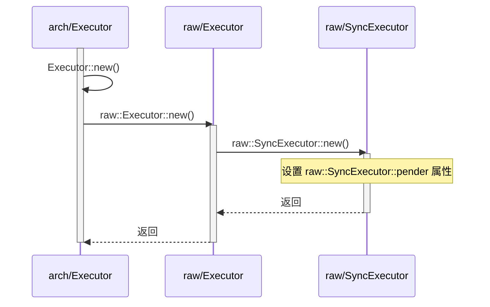
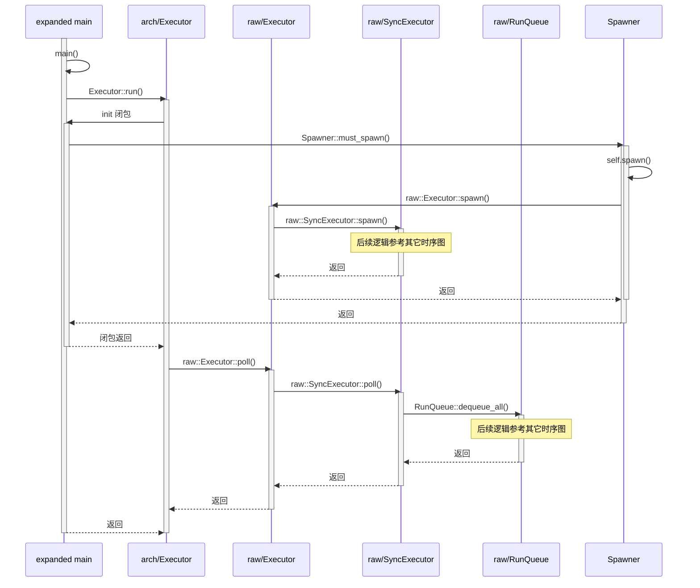

# src/arch/std.rs 源码分析

## 关于 __pender()

```rust
pub use thread::*;
mod thread {
    #[export_name = "__pender"]
    fn __pender(context: *mut ()) {
        let signaler: &'static Signaler = unsafe { std::mem::transmute(context) };
        signaler.signal()
    }

    /// Single-threaded std-based executor.
    pub struct Executor {
        inner: raw::Executor,
        not_send: PhantomData<*mut ()>,
        signaler: &'static Signaler,
    }

    impl Executor {
        /// Create a new Executor.
        pub fn new() -> Self {
            let signaler = Box::leak(Box::new(Signaler::new()));
            Self {
                inner: raw::Executor::new(signaler as *mut Signaler as *mut ()),
                not_send: PhantomData,
                signaler,
            }
        }
    
        /// Run the executor.
        pub fn run(&'static mut self, init: impl FnOnce(Spawner)) -> ! {
            init(self.inner.spawner());

            loop {
                unsafe { self.inner.poll() };
                self.signaler.wait()
            }
        }
    }
}
```

这里的 ``__pender()`` 与 [src/raw/mod.rs 中的 extern "Rust" fn __pender()](https://github.com/hy-huang20/rust-os-learning/blob/main/%E8%BF%87%E7%A8%8B%E8%AE%B0%E5%BD%95/rust/rust%E5%BC%82%E6%AD%A5/Embassy/executor/raw/mod.md#%E5%85%B3%E4%BA%8E-__pender) 相对应。



所以 src/raw/ 中 ``Pender`` 类型中的 ``*mut ()`` 实际上被设置为了 src/arch/std.rs 中的 ``signaler as *mut Signaler as *mut ()``。所以在 src/raw/mod.rs 中的：

```rust
// src/raw/mod.rs

pub(crate) struct SyncExecutor {
    run_queue: RunQueue,
    pender: Pender,
}

impl SyncExecutor {
    #[inline(always)]
    unsafe fn enqueue(&self, task: TaskRef, l: state::Token) {
        if self.run_queue.enqueue(task, l) {
            self.pender.pend();
        }
    }
}
```

``self.pender.pend()`` 实际会调用 src/arch/std.rs 中的 ``__pender()``，作用是 notify 这里的 ``Executor::run()`` 的 loop 中的 ``self.signaler.wait()`` 使之继续执行。所以可以理解为 raw 那边每调用一次 ``__pender()`` 这边就执行一次 ``self.inner.poll()``。

## 关于 self.inner.poll()



这里截取了[例子](https://github.com/hy-huang20/rust-learning/tree/main/embassy-learning)中一部分展开过程宏之后的 main 代码：（上图中 expand main）

```rust
// embassy-learning/src/expand.rs

fn main() -> ! {
    unsafe fn __make_static<T>(t: &mut T) -> &'static mut T {
        ::core::mem::transmute(t)
    }
    let mut executor = ::embassy_executor::Executor::new();
    let executor = unsafe { __make_static(&mut executor) };
    executor
        .run(|spawner| {
            spawner.must_spawn(__embassy_main(spawner));
        })
}
```