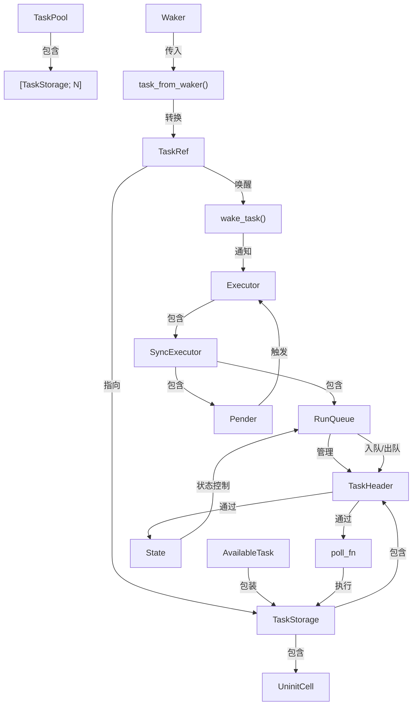

# src/raw/mod.rs 源码

## 图示

可能需要完善



## 函数调用栈

```mermaid
sequenceDiagram
    participant Main
    participant FuncA
    participant FuncB
    participant FuncC

    Main->>FuncA: 调用 FuncA
    activate FuncA  # 压栈（模拟）
    FuncA->>FuncB: 调用 FuncB
    activate FuncB
    FuncB->>FuncC: 调用 FuncC
    activate FuncC
    FuncC-->>FuncB: 返回
    deactivate FuncC # 弹栈（模拟）
    FuncB-->>FuncA: 返回
    deactivate FuncB
    FuncA-->>Main: 返回
    deactivate FuncA
```