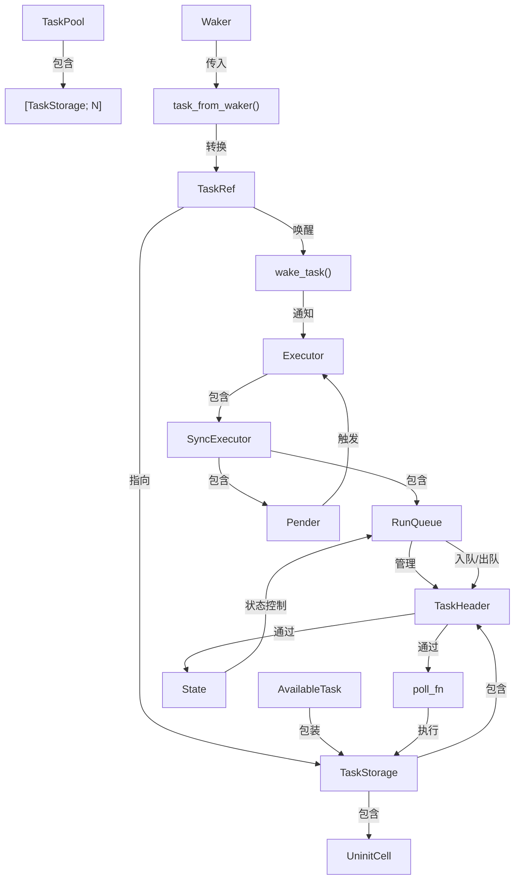
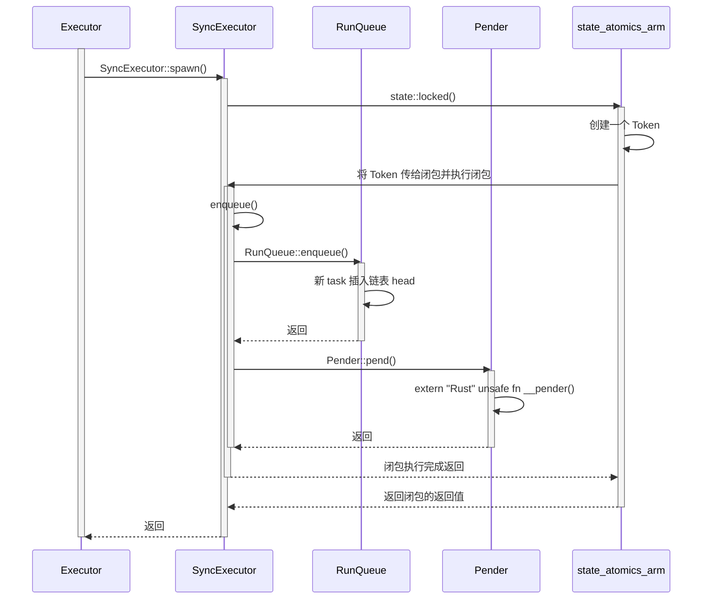

# src/raw/mod.rs 源码

## 图示

可能需要完善

```mermaid
graph TD
    %% 核心类型
    A[Executor] -->|包含| B[SyncExecutor]
    B -->|包含| C[RunQueue]
    B -->|包含| D[Pender]
    C -->|管理| E[TaskHeader]
    
    %% 任务存储结构
    F[TaskStorage<F>] -->|包含| E
    F -->|包含| G[UninitCell<F>]
    
    %% 任务池
    H[TaskPool<F,N>] -->|包含| I["[TaskStorage<F>; N]"]
    
    %% 引用关系
    J[TaskRef] -->|指向| F
    K[AvailableTask<F>] -->|包装| F
    
    %% 执行流程
    D -->|触发| A
    E -->|通过| L[State]
    L -->|状态控制| C
    E -->|通过| M[poll_fn]
    M -->|执行| F
    
    %% 队列关系
    C -->|入队/出队| E
    N[Waker] -->|传入| P["task_from_waker()"]
    P --> |转换| J
    J -->|唤醒| O["wake_task()"]
    O -->|通知| A
```

## 函数调用栈

### Executor::spawn()

```mermaid
sequenceDiagram
    participant Executor
    participant SyncExecutor
    participant RunQueue
    participant Pender
    participant state_atomics_arm

    activate Executor
        Executor->>SyncExecutor: SyncExecutor::spawn()
        activate SyncExecutor
            SyncExecutor->>state_atomics_arm: state::locked()
            activate state_atomics_arm
                state_atomics_arm->>state_atomics_arm: 创建一个 Token
                state_atomics_arm->>SyncExecutor: 将 Token 传给闭包并执行闭包
                activate SyncExecutor
                    activate SyncExecutor
                        SyncExecutor->>SyncExecutor: enqueue()
                        SyncExecutor->>RunQueue: RunQueue::enqueue()
                        activate RunQueue
                            RunQueue->>RunQueue: 新 task 插入链表 head
                            RunQueue-->>SyncExecutor: 返回
                        deactivate RunQueue
                        SyncExecutor->>Pender: Pender::pend()
                        activate Pender
                            Pender->>Pender: extern "Rust" unsafe fn __pender()
                            Pender-->>SyncExecutor: 返回
                        deactivate Pender
                    deactivate SyncExecutor
                    SyncExecutor-->>state_atomics_arm: 闭包执行完成返回
                deactivate SyncExecutor
                state_atomics_arm-->>SyncExecutor: 返回闭包的返回值
            deactivate state_atomics_arm
            SyncExecutor-->>Executor: 返回
        deactivate SyncExecutor
    deactivate Executor
```

#### 关于 __pender()

TODO