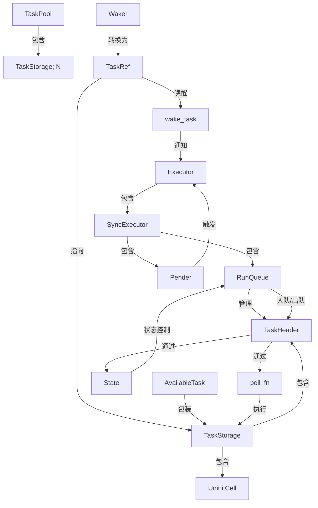

# src/raw/mod.rs 源码

```mermaid
graph TD
    %% 核心类型
    A[Executor] -->|包含| B[SyncExecutor]
    B -->|包含| C[RunQueue]
    B -->|包含| D[Pender]
    C -->|管理| E[TaskHeader]
    
    %% 任务存储结构
    F[TaskStorage<F>] -->|包含| E
    F -->|包含| G[UninitCell<F>]
    
    %% 任务池
    H[TaskPool<F,N>] -->|包含| I[TaskStorage<F>; N]
    
    %% 引用关系
    J[TaskRef] -->|指向| F
    K[AvailableTask<F>] -->|包装| F
    
    %% 执行流程
    D -->|触发| A
    E -->|通过| L[State]
    L -->|状态控制| C
    E -->|通过| M[poll_fn]
    M -->|执行| F
    
    %% 队列关系
    C -->|入队/出队| E
    N[Waker] -->|转换为| J
    J -->|唤醒| O[wake_task]
    O -->|通知| A
```