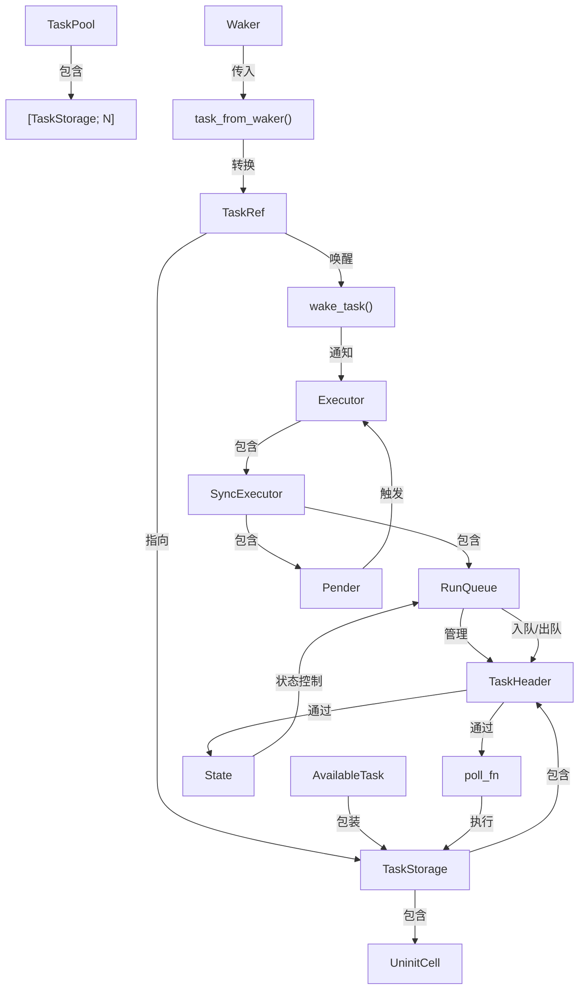
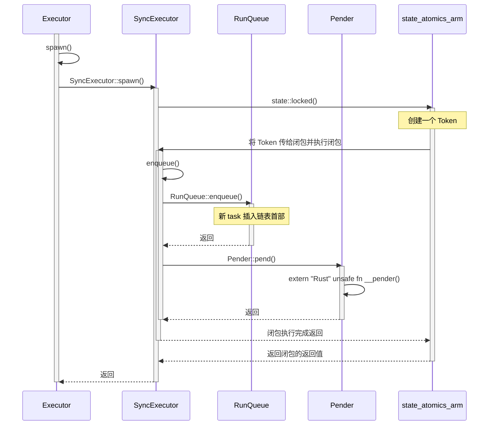
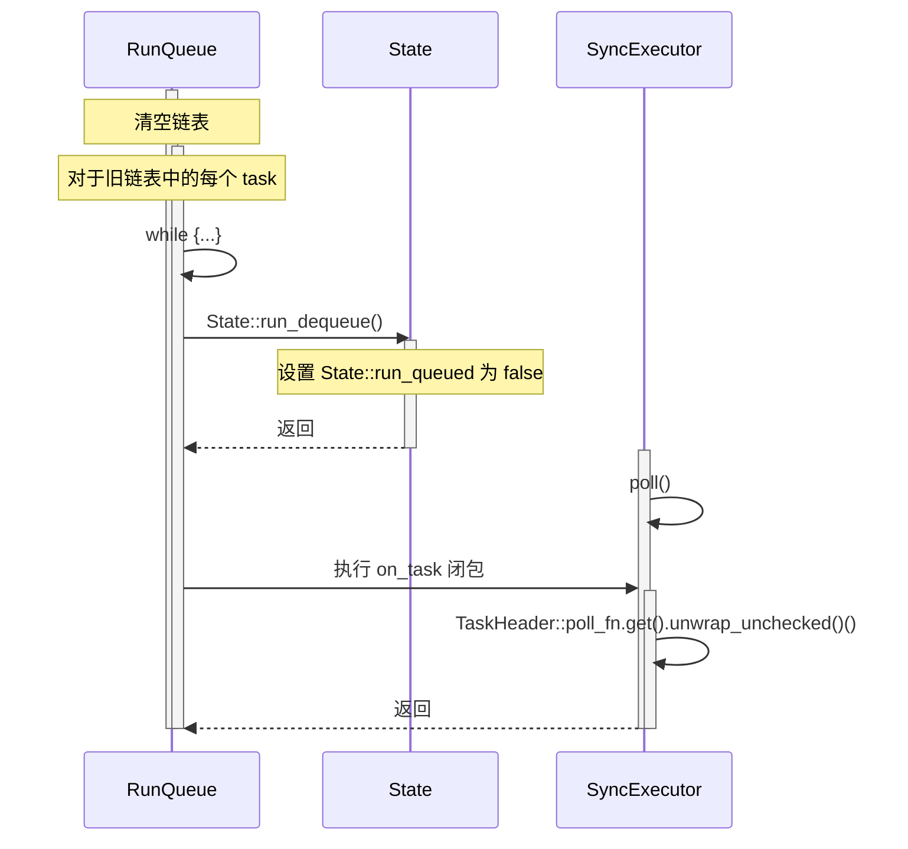
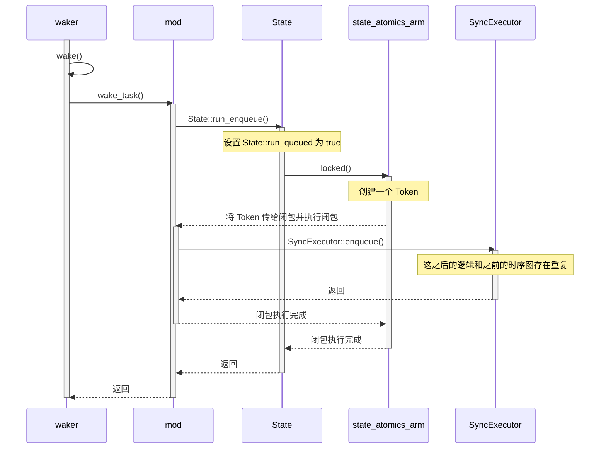
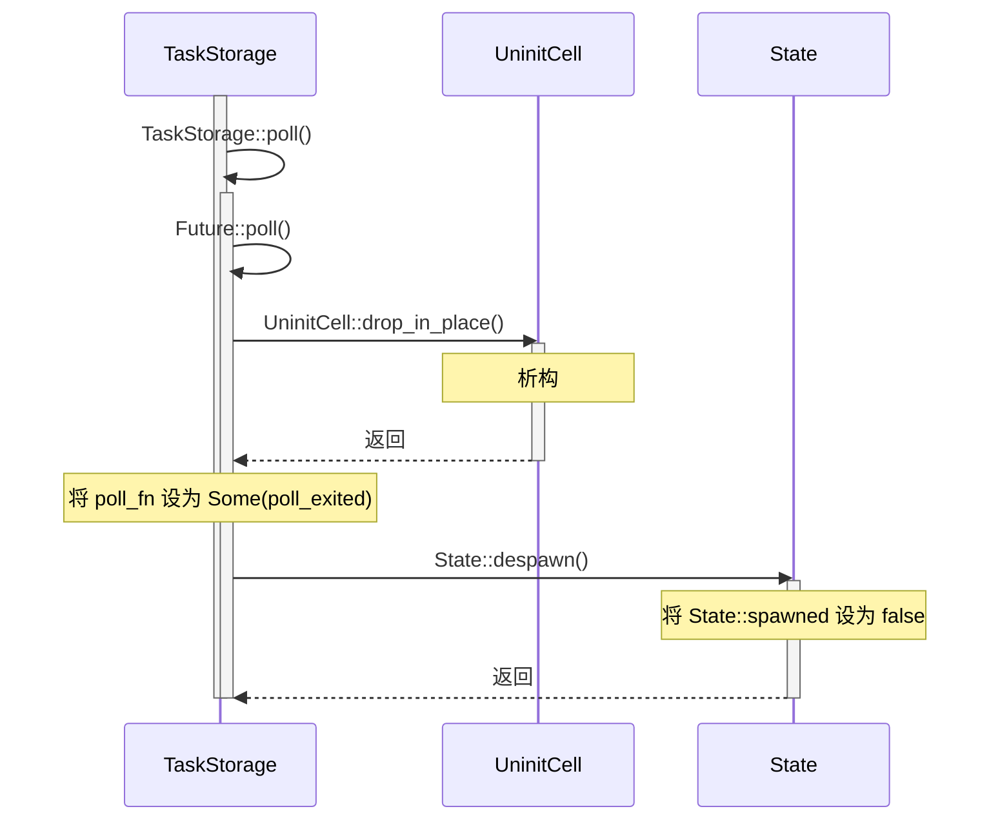

# src/raw/mod.rs 源码

TODO: ai 生成，继续完善 



参考 src/raw/mod.rs 中的注释：

```rust
/// Raw task header for use in task pointers.
///
/// A task can be in one of the following states:
///
/// - Not spawned: the task is ready to spawn.
/// - `SPAWNED`: the task is currently spawned and may be running.
/// - `RUN_ENQUEUED`: the task is enqueued to be polled. Note that the task may be `!SPAWNED`.
///    In this case, the `RUN_ENQUEUED` state will be cleared when the task is next polled, without
///    polling the task's future.
///
/// A task's complete life cycle is as follows:
///
/// ```text
/// ┌────────────┐   ┌────────────────────────┐
/// │Not spawned │◄─5┤Not spawned|Run enqueued│
/// │            ├6─►│                        │
/// └─────┬──────┘   └──────▲─────────────────┘
///       1                 │
///       │    ┌────────────┘
///       │    4
/// ┌─────▼────┴─────────┐
/// │Spawned|Run enqueued│
/// │                    │
/// └─────┬▲─────────────┘
///       2│
///       │3
/// ┌─────▼┴─────┐
/// │  Spawned   │
/// │            │
/// └────────────┘
/// ```
///
/// Transitions:
/// - 1: Task is spawned - `AvailableTask::claim -> Executor::spawn`
/// - 2: During poll - `RunQueue::dequeue_all -> State::run_dequeue`
/// - 3: Task wakes itself, waker wakes task, or task exits - `Waker::wake -> wake_task -> State::run_enqueue`
/// - 4: A run-queued task exits - `TaskStorage::poll -> Poll::Ready`
/// - 5: Task is dequeued. The task's future is not polled, because exiting the task replaces its `poll_fn`.
/// - 6: A task is waken when it is not spawned - `wake_task -> State::run_enqueue`
```

一个 task 的 ``State`` 属性存放在 ``TaskHeader`` 类型中：

```rust
// src/raw/mod.rs

pub(crate) struct TaskHeader {
    pub(crate) state: State,

    // ...
}
```

关于 A task's complete life cycle 下面那张状态转移图中的状态，可以对照 State 类型的属性：

```rust
// src/raw/state_atomics_arm.rs

#[repr(C, align(4))]
pub(crate) struct State {
    /// Task is spawned (has a future)
    spawned: AtomicBool,
    /// Task is in the executor run queue
    run_queued: AtomicBool,
    pad: AtomicBool,
    pad2: AtomicBool,
}
```

|task state|State::spawned|State::run_queued|
|---|---|---|
|``Not spawned``|false|false|
|``Spawned\|Run enqueued``|true|true|
|``Spawned``|true|false|
|``Not spawned\|Run enqueued``|false|true|

以下按照注释中的划分来研究 mod.rs 源码。

## 1: Task is spawned

### AvailableTask::claim()

```rust
impl<F: Future + 'static> AvailableTask<F> {
    /// Try to claim a [`TaskStorage`].
    ///
    /// This function returns `None` if a task has already been spawned and has not finished running.
    pub fn claim(task: &'static TaskStorage<F>) -> Option<Self> {
        task.raw.state.spawn().then(|| Self { task })
    }
}
```

``task.raw.state.spawn()`` 的功能主要是将 ``task.raw.state`` 的 ``spawned`` ``run_queued`` 属性均设置为 true 以**完成状态转移**，并返回是否成功的 bool 值。而 then 如果前面返回的为 true 则执行闭包，即返回状态转移后的 task。

### Executor::spawn()



#### 关于 __pender()

```rust
extern "Rust" {
    fn __pender(context: *mut ());
}
```

TODO

#### 关于 Token

TODO

## 2: During poll

### RunQueue::dequeue_all() 和 State::run_dequeue()

详细文字记录可[参考](./run_queue_atomics.md)。下图左，从调用 RunQueue::dequeue_all() 开始：



#### 关于 poll_fn

目前暂时不知道 poll_fn 作为一个函数指针是干什么用的

TODO

## 3: Task wakes itself, waker wakes task, or task exits



#### 关于 src/raw/waker.rs 中的 wake()

似乎在 src/raw/ 中没有看到这个函数被调用过...因此暂时没搞懂注释中提到的 "task wakes itself" 的原理

TODO

## 4: A run-queued task exits



## 5: Task is dequeued

The task's future is not polled, because exiting the task replaces its ``poll_fn``.

应该是调用了 ``State::run_dequeue()`` 完成状态的转换。而这个函数在 src/raw/ 中只在 ``RunQueue::dequeue_all()`` 中调用过，[同 2](#2-during-poll)。

## 6: A task is waken when it is not spawned

[同 3](#3-task-wakes-itself-waker-wakes-task-or-task-exits)。