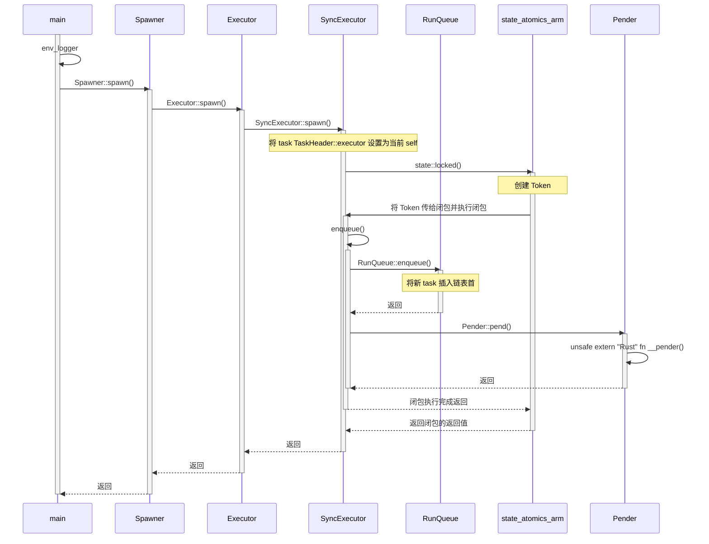

# embassy-executor 包

从一个简单的[例子](https://github.com/hy-huang20/rust-learning/blob/embassy-learning/embassy-learning/src/main.rs)开始：

```rust
// embassy-learning/src/main.rs

use embassy_executor::{Spawner, task, main};
use embassy_time::{Timer, Duration};
use log::*;

#[task]
async fn run() {
    loop {
        info!("tick");
        Timer::after_secs(1).await;
    }
}

#[main]
async fn main(spawner: Spawner) {
    env_logger::builder()
        .filter_level(log::LevelFilter::Debug)
        .format_timestamp_nanos()
        .init();

    spawner.spawn(run()).unwrap();
}
```

这个程序功能很简单，每秒打印一个 tick。

>### Rust 的 Procedural Macro
>
>过程宏，比如这里的 ``#[task]``，``#[main]``，宏的转换过程在编译时执行。这里的 run 函数作为 async 函数，虽然编程者没有写返回值，但 Rust 会将其转换成返回值为 ``impl Future<Output = ()>`` 的函数。而简单来说，这里过程宏 ``#[task]`` 的作用便是
>
>详细内容可参考 [embassy-executor 的过程宏](./proc-macro.md)。

这里通过 ``embassy_executor::Spawner::spawn()`` 添加异步 task。

从 main 开始的、加上后续的函数调用时序图示如下：

TODO: 还没有考虑 pro-macro 可能需要继续完善

