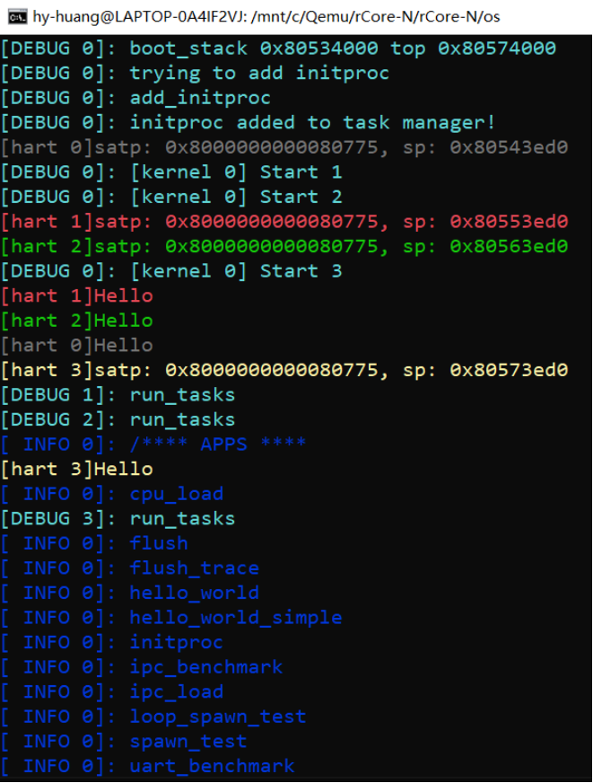
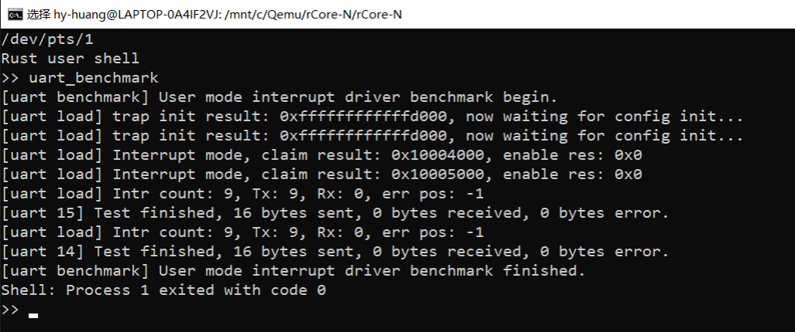

# 跑 rCore-N

## 资料

- rCore-N 仓库地址：
https://github.com/duskmoon314/rCore-N
- 参考林晨学长的记录：
https://github.com/BITcyman/Rust-os-learning/blob/main/rCore-N.md
- 以及这篇博客：
https://zjp-cn.github.io/os-notes/async-os-dev-log_rCore-N.html

## 踩坑过程

项目文件组织

- rCore-N
- qemu
- qemu-build

需要让 rCore-N 和 qemu-build 位于同一文件夹下（原因可以参考 makefile, justfile 中关于 QEMU 的设置）

一些工具安装

```
cargo install cargo-binutils
rustup component add llvm-tools-preview
rustup component add rust-src
```

如果 install 失败则在后面添加 --locked 选项

rCore-N 作者的最新 Commit 似乎无法通过编译（2023-08，主要是 user/src/user_uart.rs 文件），参考林晨学长毕设时间（2023 上半年），于是使用这个 commit: e2f8266b26b70e4069cca0b3b9386b1917c36f8b 的内容（2023-03-30），编译通过。

qemu 启动一直有问题，于是去掉了两个 tcp 的 -serial，似乎可以看见正常输出了（暂时还未确定这样的改动会造成什么影响）




